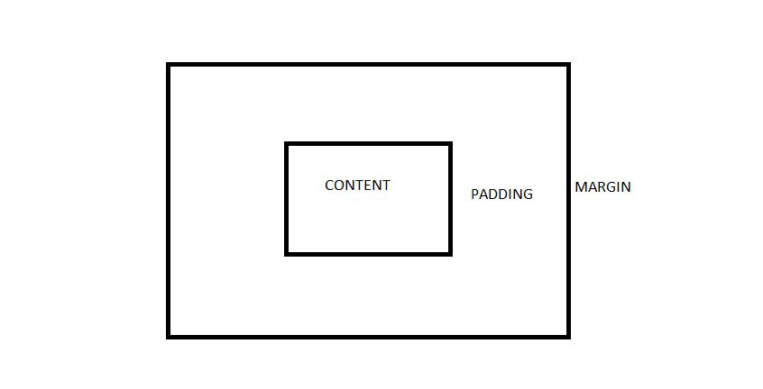

CLASS 01 - THE 2026 WEB ECOSYSTEM

THEORY
1.  DOM TREE ---> RENDER TREE ---> LAYOUT ---> PAINT
    DOM TREE consist all the structure and the content of a HTML document that will be render on the browser, then the RENDER TREE that is like the combination of both a HTML structure and CSS which is going to be rendered on the browser. As the CSS and HTML document is being rendered, the LAYOUT is the way the elements, the sizes of the elements are being positioned on the browser or within the viewport of any device. PAINT is final stage that converts all the processes in the render tree and layout into actual pixels that the user see on his/her browser's screen.

2.  HTTP/3 uses QUIC instead of TCP because it improves the performance of web applications by establishing number of connections between two endpoints using UDP and also it allows multiple streams of data to reach endpoints independently enabling faster connections. It matters because it makes websites with many resources like images, CSS files and scripts load faster, it improves performance over congested netowrks by preventing data blockages and it is also encrypted.

3.  I do not know any website that did not use semantic html properly but the clues that tells if a website did not uses semantic html properly is that it will be difficult for users to navigate through the website, browsers won't be able to perceive the content's structure and present it accordingly and search engines won't be to understand the logical structure of the content.

PRODUCT THINKING
1. Semantic html used when building a website like a blog enables the website to be understood by search engines and accessible by users through search engine optimization.
2. When building a multiplayer game, the edge computing benefits that will matter most to me, will the reduction of latency and improved network efficiency because with edge computing data that takes time to travel will be processed and stored close to where it was created thereby reducing lag time and data are locally so that less data travels between networks thereby improving network efficiency.

ENGINEERING BEST PRACTICE
1. I totally disagree because semantic html enables the content of a website to be perceived by browser, easily navigated and acessible by the users through sarch engines. Semantic html makes your code clean and well structured and readable by other developers.

CLASS 02 - TYPOGRAPHY AND INFORMATION HIERARCHY

THEORY
1. Difference between emphasis tag and italic tag is that em element is used when you want to make an emphasis ie verbal stress on a word in a sentence e.g <em>Don't</em> swim here, it is a private property while italic element is just used to italize a word in a sentence e.g <i>The New York Times</i>.

2. img, anchor element and button element are treat specially by the browser because img has an alt attribute that the screen reader tells the users the name of the image, the broswer tells the users any thing wiithin the anchor element that it is a link and the browser tells the user anything within the button element that it is a button.

3. Aria-label attribute is used when a button is without a text or you have a clickable image in your website if not then just fix your HTML structure.

ACCESSIBILITY REFLECTION
1. I check the INEC portal website, i could go through the website using tab and the navigation link dropdown had well structure dropdown with clear hover states with clickable logo that direct users to its website.

PRODUCT THINKING
1. <h1>Food API Documentation</h1>
    <h2>Overview</h2>
    <h2>How to use the api</h2>
    <h2>Measures/Precaution</h2>
    <h3>Debugging details if error is encountered.</h3>

CLASS 03 - MODERN ASSETS AND LINKING

THEORY
1. I will convert the 5MB PNG to WEBP using adobe photoshop because the format will provide for a better compression making the image size smaller and less time to download and load.

2. Srcset is an atrribute used to specify possible images the browser can use. If a mobile user is having a slow internet network, srcset will enable the browser to select image with less size in order reduce the load time.

3. It prevent malicious code from being inserted or having access to a website. It prevents your sensitive information entered into a website from being exposed.

ENGINEERING THINKING
1. picture element along with source element will used with possible formats like webp and jpeg so that the browser will image format to fall back making the website responsive and incase of lazy loading.

CLASS 04 - MODERN FORMS AND USER EXPERIENCE

THEORY
1. When a user data is entered, the browser checks the data if it is in a correct format before sending it to the server if not the user is prompt to input the valid format but if the invalid data reaches the server it is rejected and there is noticeable delay caused by the trip to the server and then back to the client-side to tell the user to fix their data.

2. Autocomplete attribute gives permission to the browser for automated assistance in filling out form field values. Examples of autocomplete values are on, off, tel, email, country etc
-- on: This gives the the browser for automated assistance in filling out form field values.
-- off: The browser is not permitted to automatically select or enter a value for a form field.
-- tel: Request for automated full telephone number including country code.
-- email: Request for automated email address.
-- country: Request for automated country code.

PRODUCT THINKING
1. LocalStorage will be used to store the data locally if the user loses internet while the required attribute will be used to make an input mandatory and will display an error if the input is empty.

2. select element is used in forms when the options are logically ordered and it offers the best accessibility because it is supported by screen-readers.

ENGINEERING BEST PRACTICE
1. The password input box will have a type, name, maxlength and minlength, required, autocomplete, pattern and placeholder attribute.

CLASS 04 - CSS ENGINE (BOX MODEL AND SPECIFICITY)

THEORY
1.  , if two divs are adjacent each other with a margin-top of 20px and a margin-bottom of 30px, i think the space between them will be 30px because of margin collapsing that helps set consistent spacing.

2. CSS Specificity is the rule that determine which style is applied on an element. In CSS specificity hierarchy, inline styles takes the highest priority, id selectors takes second highest priority, classes takes the third highest while elements takes the lowest priority. Between .header nav ul li a, nav a.active and .nav-links a, .header nav ul li a wins because it has 1 class and 4 elements while nav a.active has 1 class and 2 elements and .nav-links a has 1 class and 1 elements.

3. Cascade is the way browser solves conflicts when multiple CSS rules are applied to an HTML element. When multiple same CSS rules are applied to an HTML element, the browser resolve that by selecting the CSS rule to apply based on its position or specificity.

ENGINEERING THINKING
1. By default, the padding and border is added to the width so 10px of padding is added to the width of the element, to fix this you apply the box-sizing: border-box CSS declaration.

2. .box {
    width: 200px;
    padding: 20px;
    border: 5px solid black;
    box-sizing: content-box;
} 
By default box-sizing is content-box, according to the CSS declaration, the box will be 250px i.e the width plus the height of the content excluding the padding and border.
.box {
    width: 300px;
    padding: 20px;
    border: 5px solid black;
    box-sizing: border-box;
}
According to the CSS declaration, the box will be 300px including the padding and border.
